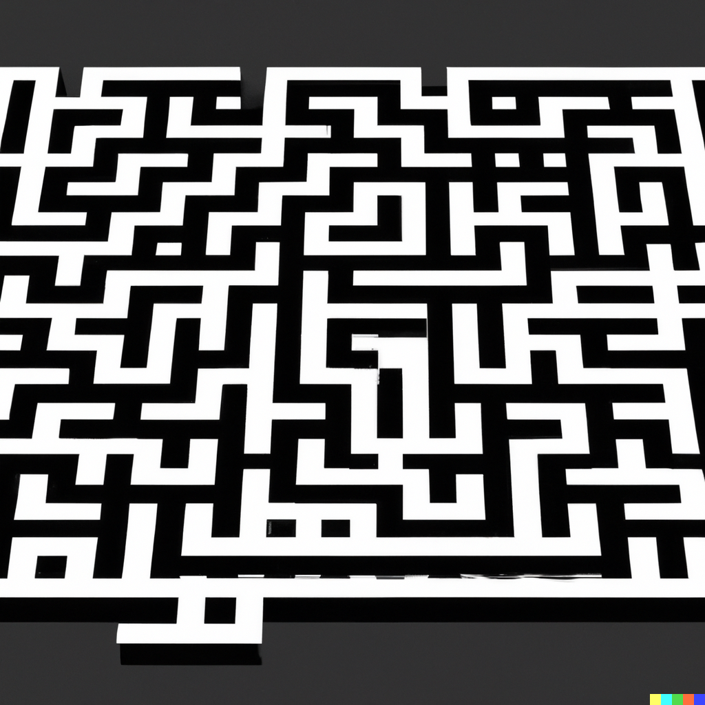

<!-- PROJECT LOGO -->
 

  
  <h3 align="center">Amazeing Dungeon</h3>

<!-- TABLE OF CONTENTS -->
  <h2 style="display: inline-block">Table of Contents</h2>
  <ol>
    <li>
      <a href="#about-the-project">About The Project</a>
      <ul>
        <li><a href="#built-with">Built With</a></li>
      </ul>
    </li>
    <li>
      <a href="#getting-started">Getting Started</a>
      <ul>
        <li><a href="#prerequisites">Prerequisites</a></li>
        <li><a href="#installation">Installation</a></li>
      </ul>
    </li>
    <li><a href="#deployment">Deployment</a></li>
    <li><a href="#contributing">Contributing</a></li>
  </ol>

<!-- ABOUT THE PROJECT -->
## About The Project

Dungeon Explorer Game

### Built With

* Rust - Game Play
* WebAssembly (Wasm) - Web Execution 

<!-- GETTING STARTED -->
## Getting Started

To get a local copy up and running follow these simple steps.

### Prerequisites

* Rust

### Installation
1. `cargo run` will start up the game.

<!-- DEPLOYMENT -->
## Deployment

Install toolchains via `rustup target add wasm32-unknown-unknown` and bindgen via `cargo install wasm-bindgen-cli`

1. `cargo build --target wasm32-unknown-unknown --release` will build the wasm file.
2. `wasm-bindgen target/wasm32-unknown-unknown/release/amazeing_dungeon.wasm --out-dir ./wasm-help/ --no-modules --no-typescript` will create the javascript file.

<!-- CONTRIBUTING -->
## Contributing

Contributions are what make the community such an amazing place to be learn, inspire, and create. Any contributions you make are **greatly appreciated**.

1. Create your Feature Branch (`git checkout -b feature/AmazingFeature`)
2. Commit your Changes (`git commit -m 'Add some AmazingFeature'`)
3. Push to the Branch (`git push origin feature/AmazingFeature`)
4. Open a Pull Request